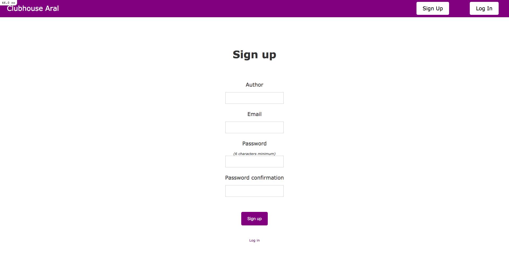

# Members-Only

In this project users can sign up and log in into the site as members and make posts. If you are not logged in you won't be able to see the authors of the posts.

# About

The purpouse of this project was how to use the devise gem to handdle user authentication and registration processes.

In this project we:
- Created models, views and controllers for users and posts
- Made validations for the user inputs
- Used the devise gem, a gem that is used for user authorization and authentication features
- Worked with view helpers
# Application Screenshot

# Built With:
- Ruby on Rails
- SQLite
- Rubocop

# Prerequesites:
- Ruby
- Rails
- Yarn

# To Run:
- Clone this repository.
- Open the project folder where the repository was downloaded.
- In your terminal, run the command `bundle install`. This will install all the required dependencies.
- Thereafter, run the migrations. To do this, while in the project root folder, run the command: `rails db:migrate`.
- Run the command `yarn install --check-files` to install all the yarn dependencies of the project.
- Start the server with `rails s`, and visit **localhost:3000** to start writting posts.

# Authors

👤 **Alexisbec**
- Github: [@alexisbec](https://github.com/alexisbec)
- Linkedin: [Alexis Varela](www.linkedin.com/in/alexbec)
- Twitter : [@AlexisV31667779](https://twitter.com/AlexisV31667779)

👤 **Arturo Alvarez**
- Github: [@StarSheriff2](https://github.com/StarSheriff2)
- Twitter: [@ArturoAlvarezV](https://twitter.com/ArturoAlvarezV)
- Linkedin: [Arturo Alvarez](https://www.linkedin.com/in/arturoalvarezv/)

# 🤝 Contributing

Contributions, issues and feature requests are welcome!

Feel free to check the issues page.

# Show your support
Give a ⭐️ if you like this project!

# 📝 License
This project is for microverse course purposes.
